# GitLab Major Version Upgrade Guide


> **A battle-tested guide for upgrading GitLab CE from v12 to v18 through 22 version steps and 2 OS migrations with zero data loss.**

Based on real-world experience upgrading a production GitLab instance managing 100+ repositories, this guide provides step-by-step procedures, automation scripts, and troubleshooting playbooks.

---

## 📊 Upgrade Summary

| Metric               | Value                                  |
| -------------------- | -------------------------------------- |
| **Starting Version** | GitLab CE 12.1.6 (July 2019)           |
| **Target Version**   | GitLab CE 18.5.2 (Latest)              |
| **Total Steps**      | 22 GitLab upgrades + 2 OS upgrades     |
| **Execution Time**   | ~40 hours (one weekend: Fri-Mon)       |
| **Repositories**     | 100+ repos with full history preserved |
| **Data Loss**        | **Zero** ✅                             |
| **Downtime**         | Minimal (maintenance windows only)     |

---

## 🗺️ Upgrade Path Matrix

```mermaid
graph TD
    A[12.1.6<br/>Starting Point] --> B[12.10.14]
    B --> C[13.0.14]
    C --> D[13.1.11]
    D --> E[13.8.8]
    E --> F[13.12.15]
    
    F --> G[Ubuntu 16→18<br/>OS Upgrade]
    G --> H[14.0.12]
    
    H --> I[14.3.6]
    I --> J[14.9.5]
    J --> K[14.10.5]
    K --> L[15.0.5]
    L --> M[15.4.6]
    M --> N[15.11.13]
    N --> O[16.3.9]
    O --> P[16.7.10]
    P --> Q[16.11.10]
    
    Q --> R[Ubuntu 18→20<br/>OS Upgrade]
    R --> S[17.1.8]
    
    S --> T[17.3.7]
    T --> U[17.5.5]
    U --> V[17.8.7]
    V --> W[17.11.7]
    W --> X[18.2.8]
    X --> Y[18.5.2<br/>Target]
    
    style A fill:#ff6b6b
    style Y fill:#51cf66
    style G fill:#ffd43b
    style R fill:#ffd43b
```



---

## 🚀 Quick Start

### Prerequisites

- Ubuntu 16.04/18.04/20.04 server
- Root or sudo access
- GitLab CE instance (any version >= 12.x)
- At least **30% free disk space** on `/var` partition
- AWS CLI (for AMI backups) or alternative snapshot mechanism

> **💡 Pro Tip**: Work on a **cloned instance** (AMI snapshot), not production. This guide assumes you've created an EC2 AMI of your production GitLab and launched a new instance for the upgrade.

> **⚡ Performance Tip**: Increase EBS IOPS (16000+) and throughput (1000 MB/s) before starting. Background migrations are I/O-intensive and this can cut migration time by 30-40%.

### 1. Clone This Repository

```bash
git clone https://github.com/vishalrath0d/gitlab-upgrade.git
cd gitlab-upgrade
```

### 2. Review the Upgrade Path

Use the [official GitLab upgrade path tool](https://gitlab-com.gitlab.io/support/toolbox/upgrade-path/) to determine your specific path:

```bash
# Example: From 12.1.6 to 18.5.2
Current: 12.1.6
Target: 18.5.2
Edition: CE
```

### 3. Create Initial Backups

```bash
# Run the backup script
./scripts/backup.sh

# Verify backups
ls -lh /backup/gitlab-upgrade-$(date +%Y%m%d)/
```

### 4. Start Upgrading

Follow the detailed guide in [`docs/02-upgrade-path.md`](docs/02-upgrade-path.md).

For each version step:

```bash
# Stop services
gitlab-ctl stop puma
gitlab-ctl stop sidekiq

# Install target version
apt-get install gitlab-ce=<VERSION>

# Reconfigure and restart
gitlab-ctl reconfigure
gitlab-ctl restart

# Verify migrations complete
./scripts/check-migrations.sh
```

---

## 📚 Documentation

| Document                                                    | Description                                      |
| ----------------------------------------------------------- | ------------------------------------------------ |
| [01-planning.md](docs/01-planning.md)                       | Pre-upgrade planning and risk assessment         |
| [02-upgrade-path.md](docs/02-upgrade-path.md)               | Step-by-step upgrade procedures for all 22 steps |
| [03-backup-strategy.md](docs/03-backup-strategy.md)         | Backup procedures and AMI snapshot creation      |
| [04-troubleshooting.md](docs/04-troubleshooting.md)         | Common errors and their solutions                |
| [05-rollback-procedures.md](docs/05-rollback-procedures.md) | How to safely rollback if something goes wrong   |

---

## 🛠️ Scripts & Automation

### [`scripts/backup.sh`](scripts/backup.sh)
Automated backup script for GitLab data and configuration.

```bash
./scripts/backup.sh
```

### [`scripts/check-migrations.sh`](scripts/check-migrations.sh)
Monitor background and batched migrations status.

```bash
./scripts/check-migrations.sh

# Output:
# === Background Migrations ===
# 0
#
# === Batched Migrations (v14+) ===
# 0
```

### [`scripts/verify-health.sh`](scripts/verify-health.sh)
Comprehensive health check after each upgrade step.

```bash
./scripts/verify-health.sh

# Checks:
# ✓ GitLab version
# ✓ All services running
# ✓ Database migrations
# ✓ Repository integrity
# ✓ Redis connectivity
```

### [`scripts/cleanup-old-backups.sh`](scripts/cleanup-old-backups.sh)
Remove old backups while keeping critical snapshots.

```bash
./scripts/cleanup-old-backups.sh --keep 7
```

---

## ⚠️ Critical Lessons Learned

### 1. **Never Skip Versions**
GitLab's background migrations are sequential. Skipping versions will corrupt your database.

### 2. **Wait for Migrations to Complete**
Both background and batched migrations must reach **zero** before proceeding:

```bash
gitlab-rails runner "puts Gitlab::BackgroundMigration.remaining"
# Must output: 0

gitlab-rails runner "puts Gitlab::Database::BackgroundMigration::BatchedMigration.queued.count"
# Must output: 0
```

### 3. **Disk Space Will Kill You**
Each upgrade creates an 8GB+ backup. Monitor disk space:

```bash
df -h
# Keep at least 20-30% free on /var
```

### 4. **Create AMI Snapshots Before OS Upgrades**
Ubuntu upgrades (16→18→20) can fail. Always have a snapshot:

```bash
aws ec2 create-image \
  --instance-id i-xxxxx \
  --name "gitlab-backup-$(date +%Y%m%d)" \
  --no-reboot
```

### 5. **Budget Time for Large Instances**
With 100+ repos:
- Minor version upgrades: 30-60 minutes
- Major version upgrades: 2-4 hours (background migrations)
- OS upgrades: 1-2 hours

---

## 🐛 Common Issues & Fixes

### Issue: Puma Port Conflict (v13.0.14)

**Error:**
```
Puma failed to bind to 127.0.0.1:8080
```

**Fix:** Edit `/etc/gitlab/gitlab.rb`:
```ruby
puma['listen'] = '127.0.0.1'
puma['port'] = 8085
gitlab_workhorse['auth_backend'] = "http://localhost:8085"
```

Then:
```bash
gitlab-ctl reconfigure && gitlab-ctl restart
```

### Issue: Background Migrations Stuck

**Fix:**
```bash
# Check Sidekiq status
gitlab-ctl status sidekiq

# Restart if needed
gitlab-ctl restart sidekiq

# Monitor progress
watch -n 60 './scripts/check-migrations.sh'
```

### Issue: Disk Full During Upgrade

**Fix:**
```bash
cd /var/opt/gitlab/backups/
ls -ltrh | tail -20

# Remove old backups (keep last 3-4)
rm -f <old-backup-tar-files>

df -h  # Verify space freed
```

See [`docs/04-troubleshooting.md`](docs/04-troubleshooting.md) for the complete list.

---

## 🎯 Who Is This For?

- **DevOps Engineers** managing legacy GitLab instances
- **SREs** planning major version upgrades
- **System Administrators** responsible for GitLab infrastructure
- **Teams** running GitLab CE on-premises or self-hosted environments

---

## 🤝 Contributing

Found an issue or have improvements? Contributions are welcome!

1. Fork this repository
2. Create a feature branch (`git checkout -b feature/improvement`)
3. Commit your changes (`git commit -m 'Add troubleshooting for XYZ'`)
4. Push to the branch (`git push origin feature/improvement`)
5. Open a Pull Request

---

## 📝 License

This project is licensed under the MIT License - see the [LICENSE](LICENSE) file for details.

---

## 🙏 Acknowledgments

- [Official GitLab Upgrade Documentation](https://docs.gitlab.com/ee/update/)
- [GitLab Upgrade Path Tool](https://gitlab-com.gitlab.io/support/toolbox/upgrade-path/)
- [GitLab Community Forums](https://forum.gitlab.com/)

---

## ⭐ Support

If this guide helped you successfully upgrade your GitLab instance, please:

- ⭐ **Star this repository**
- 🐦 **Share on Twitter/LinkedIn**
- 💬 **Open discussions** with your experience
- 🔗 **Link to this repo** in your own documentation

---

## 📬 Contact

**Vishal Rathod**  
DevOps Engineer | AWS | Kubernetes | Terraform

- 📧 Email: [vishaljanusingrathod@gmail.com](mailto:vishaljanusingrathod@gmail.com)
- 💼 LinkedIn: [linkedin.com/in/vishalrath0d](https://linkedin.com/in/vishalrath0d)
- 🐙 GitHub: [github.com/vishalrath0d](https://github.com/vishalrath0d)
- 📝 Blog: [Read the full story on Hashnode](https://vishalrath0d.hashnode.dev/gitlab-upgrade)

---

**Built with ❤️ by someone who spent 40 hours in terminal hell so you don't have to.**
