# GitLab CE Major Version Upgrade Guide


> **A battle-tested guide for upgrading GitLab CE from v12 to v18 through 22 version steps and 2 OS migrations with zero data loss.**

Based on real-world experience upgrading a production GitLab instance managing 100+ repositories, this guide provides step-by-step procedures, automation scripts, and troubleshooting playbooks.

---

## 📊 Upgrade Summary

| Metric               | Value                                  |
| -------------------- | -------------------------------------- |
| **Starting Version** | GitLab CE 12.1.6 (August 2019)         |
| **Target Version**   | GitLab CE 18.5.2 (Latest)              |
| **Total Steps**      | 22 GitLab upgrades + 2 OS upgrades     |
| **Execution Time**   | 40+ hours (one weekend: Fri-Mon)       |
| **Repositories**     | 100+ repos with full history preserved |
| **Data Loss**        | **Zero** ✅                             |
| **Downtime**         | Minimal (maintenance windows only)     |

---

## 📚 Table of Contents

### Documentation

| Document                                                        | Description                                                                 |
| --------------------------------------------------------------- | --------------------------------------------------------------------------- |
| **[01-planning.md](docs/01-planning.md)**                       | Pre-upgrade planning, prerequisites, risk assessment, and clone strategy    |
| **[02-upgrade-path.md](docs/02-upgrade-path.md)**               | Complete step-by-step procedures for all 22 GitLab upgrades with commands   |
| **[03-backup-strategy.md](docs/03-backup-strategy.md)**         | Backup layers (GitLab, config, AMI), restoration procedures, SSH key backup |
| **[04-troubleshooting.md](docs/04-troubleshooting.md)**         | 9 common issues with solutions (Puma, migrations, disk, SSH keys)           |
| **[05-rollback-procedures.md](docs/05-rollback-procedures.md)** | Emergency rollback options (version downgrade, AMI restore, backup restore) |

### Automation Scripts

| Script                                                       | Purpose                                                      | Usage                                        |
| ------------------------------------------------------------ | ------------------------------------------------------------ | -------------------------------------------- |
| **[backup.sh](scripts/backup.sh)**                           | Create comprehensive backups (GitLab data, config, SSH keys) | `./scripts/backup.sh`                        |
| **[check-migrations.sh](scripts/check-migrations.sh)**       | Monitor background & batched migration status                | `./scripts/check-migrations.sh`              |
| **[verify-health.sh](scripts/verify-health.sh)**             | Post-upgrade health check (services, DB, repos, Redis)       | `./scripts/verify-health.sh`                 |
| **[cleanup-old-backups.sh](scripts/cleanup-old-backups.sh)** | Clean old backups while keeping recent ones                  | ` ./scripts/cleanup-old-backups.sh --keep 7` |

---

## 🗺️ Upgrade Path Matrix

```mermaid
graph TD
    A[12.1.6<br/>Starting Point] --> B[12.10.14]
    B --> C[13.0.14]
    C --> D[13.1.11]
    D --> E[13.8.8]
    E --> F[13.12.15]
    
    F --> G[Ubuntu 16→18<br/>OS Upgrade]
    G --> H[14.0.12]
    
    H --> I[14.3.6]
    I --> J[14.9.5]
    J --> K[14.10.5]
    K --> L[15.0.5]
    L --> M[15.4.6]
    M --> N[15.11.13]
    N --> O[16.3.9]
    O --> P[16.7.10]
    P --> Q[16.11.10]
    
    Q --> R[Ubuntu 18→20<br/>OS Upgrade]
    R --> S[17.1.8]
    
    S --> T[17.3.7]
    T --> U[17.5.5]
    U --> V[17.8.7]
   V --> W[17.11.7]
    W --> X[18.2.8]
    X --> Y[18.5.2<br/>Target]
    
    style A fill:#ff6b6b
    style Y fill:#51cf66
    style G fill:#ffd43b
    style R fill:#ffd43b
```



---

## 🚀 Quick Start

### Prerequisites

- Ubuntu 16.04/18.04/20.04 server
- Root or sudo access
- GitLab CE instance (any version >= 12.x)
- At least **30% free disk space** on `/var` partition
- AWS CLI (for AMI backups) or alternative snapshot mechanism

> **💡 Pro Tip**: Work on a **cloned instance** (AMI snapshot), not production. This guide assumes you've created an EC2 AMI of your production GitLab and launched a new instance for the upgrade.

> **⚡ Performance Tip**: Increase EBS IOPS (16000+) and throughput (1000 MB/s) before starting. Background migrations are I/O-intensive and this can cut migration time by 30-40%.

### 1. Clone This Repository

```bash
git clone https://github.com/vishalrath0d/gitlab-upgrade.git
cd gitlab-upgrade
```

### 2. Review the Upgrade Path

Use the [official GitLab upgrade path tool](https://gitlab-com.gitlab.io/support/toolbox/upgrade-path/) to determine your specific path:

```bash
# Example: From 12.1.6 to 18.5.2
Current: 12.1.6
Target: 18.5.2
Edition: CE
```

### 3. Create Initial Backups

```bash
# Run the backup script
sudo ./scripts/backup.sh

# Verify backups
ls -lh /backup/gitlab-upgrade-$(date +%Y%m%d)/
```

### 4. Start Upgrading

Follow the detailed guide in [`docs/02-upgrade-path.md`](docs/02-upgrade-path.md).

**Standard workflow for each version:**

```bash
# 1. Stop services
gitlab-ctl stop puma
gitlab-ctl stop sidekiq

# 2. Install target version
apt-get install gitlab-ce=<VERSION>-ce.0

# 3. Reconfigure and restart
gitlab-ctl reconfigure
gitlab-ctl restart
sleep 180

# 4. Wait for migrations
./scripts/check-migrations.sh
# Must show: 0 for both migration types

# 5. Verify health
./scripts/verify-health.sh
```

Repeat for all 22 GitLab versions + 2 OS upgrades.

---

## ⚠️ Critical Lessons Learned

### 1. **Clone First, Upgrade Later**
Work on an AMI clone, not production. Instant rollback capability if needed. See: [`docs/01-planning.md`](docs/01-planning.md)

### 2. **Never Skip Versions**
GitLab's background migrations are sequential. Skipping versions will corrupt your database.

### 3. **Wait for Migrations to Complete**
Both background and batched migrations must reach **zero** before proceeding:

```bash
gitlab-rails runner "puts Gitlab::BackgroundMigration.remaining"
# Must output: 0

gitlab-rails runner "puts Gitlab::Database::BackgroundMigration::BatchedMigration.queued.count"
# Must output: 0 (for v14+)
```

### 4. **Copy SSH Host Keys from Old Instance**
If using AMI clone strategy, preserve SSH identity to avoid breaking Jenkins/CI/CD. See: [`docs/04-troubleshooting.md#9`](docs/04-troubleshooting.md#9-ssh-host-key-changed-jenkins-fails)

```bash
# On old instance
sudo tar -czf /tmp/ssh_host_keys.tar.gz /etc/ssh/ssh_host_*

# Copy to new instance and restore
sudo tar -xzf /tmp/ssh_host_keys.tar.gz -C /
sudo systemctl restart ssh
```

### 5. **Disk Space Will Kill You**
Each upgrade creates an 8GB+ backup. Monitor obsessively:

```bash
df -h
# Keep at least 30% free on /var

# Clean old backups if needed
./scripts/cleanup-old-backups.sh --keep 5
```

### 6. **Boost IOPS/Throughput**
Background migrations are I/O-bound. Increase EBS IOPS from 3000 to 16000 and throughput to 1000 MB/s. Saves 30-40% time on large instances.

### 7. **Budget Time for Large Instances**
With 100+ repos:
- Minor version upgrades: 30-60 minutes
- Major version upgrades: 2-4 hours (background migrations)
- OS upgrades: 1-2 hours

**Total: 40+ hours for full v12→v18 upgrade**

---

## 🐛 Common Issues & Quick Fixes

| Issue                    | Version   | Quick Fix                                                      |
| ------------------------ | --------- | -------------------------------------------------------------- |
| **Puma port conflict**   | 13.0.14   | Set `puma['port'] = 8085` in `/etc/gitlab/gitlab.rb`           |
| **crond --no-auto flag** | 14.0.12   | Remove `--no-auto` from `/opt/gitlab/sv/crond/run`             |
| **Migrations stuck**     | 14+       | Restart Sidekiq: `gitlab-ctl restart sidekiq`                  |
| **Disk full**            | Any       | Clean old backups: `./scripts/cleanup-old-backups.sh --keep 5` |
| **gitaly deprecation**   | 16.0+     | Comment out `gitaly['custom_hooks_dir']` in config             |
| **SSH key mismatch**     | AMI clone | Copy `/etc/ssh/ssh_host_*` from old instance                   |

**See [`docs/04-troubleshooting.md`](docs/04-troubleshooting.md) for detailed solutions.**

---

## 🛠️ Script Details

### backup.sh
Creates timestamped backups of:
- GitLab data (repositories, database, uploads)
- Configuration files (`/etc/gitlab/`)
- SSH host keys (`/etc/ssh/ssh_host_*`)

**Output:** `/backup/gitlab-upgrade-YYYYMMDD/`

### check-migrations.sh
Monitors both legacy and batched background migrations. Color-coded output:
- ✅ Green: All migrations complete (0)
- ⚠️ Yellow: Migrations pending
- ❌ Red: Migration errors

**Exit code:** 0 if complete, 1 if pending

### verify-health.sh
Comprehensive health check:
- GitLab version verification
- Service status (Puma, Sidekiq, PostgreSQL, Redis)
- Database migration status
- Repository integrity (fsck)
- API connectivity

### cleanup-old-backups.sh
Safe backup cleanup with dry-run mode:
```bash
./scripts/cleanup-old-backups.sh --keep 7 --dry-run  # Preview
./scripts/cleanup-old-backups.sh --keep 7             # Execute
```

Keeps specified number of most recent backups, removes older ones.

---

## 🎯 Who Is This For?

- **DevOps Engineers** managing legacy GitLab instances
- **SREs** planning major version upgrades
- **System Administrators** responsible for GitLab infrastructure
- **Teams** running GitLab CE on-premises or self-hosted environments

---

## 🤝 Contributing

Found an issue or have improvements? Contributions are welcome!

1. Fork this repository
2. Create a feature branch (`git checkout -b feature/improvement`)
3. Commit your changes (`git commit -m 'Add troubleshooting for XYZ'`)
4. Push to the branch (`git push origin feature/improvement`)
5. Open a Pull Request

---

## 📝 License

This project is licensed under the MIT License - see the [LICENSE](LICENSE) file for details.

---

## 🙏 Acknowledgments

- [Official GitLab Upgrade Documentation](https://docs.gitlab.com/update/)
- [GitLab Upgrade Path Tool](https://gitlab-com.gitlab.io/support/toolbox/upgrade-path/)
- [GitLab Community Forums](https://forum.gitlab.com/)

---

## ⭐ Support

If this guide helped you successfully upgrade your GitLab instance, please:

- ⭐ **Star this repository**
- 🐦 **Share on Twitter/LinkedIn**
- 💬 **Open discussions** with your experience
- 🔗 **Link to this repo** in your own documentation

---

## 📬 Contact

**Vishal Rathod**  
DevOps Engineer | AWS | Kubernetes | Terraform

- 📧 Email: [vishaljanusingrathod@gmail.com](mailto:vishaljanusingrathod@gmail.com)
- 💼 LinkedIn: [linkedin.com/in/vishalrath0d](https://linkedin.com/in/vishalrath0d)
- 🐙 GitHub: [github.com/vishalrath0d](https://github.com/vishalrath0d)
- 📝 Blog: [Read the full story on Hashnode](https://vishalrath0d.hashnode.dev/gitlab-upgrade)

---

**Built with ❤️ by someone who spent 40+ hours in terminal hell so you don't have to.**
